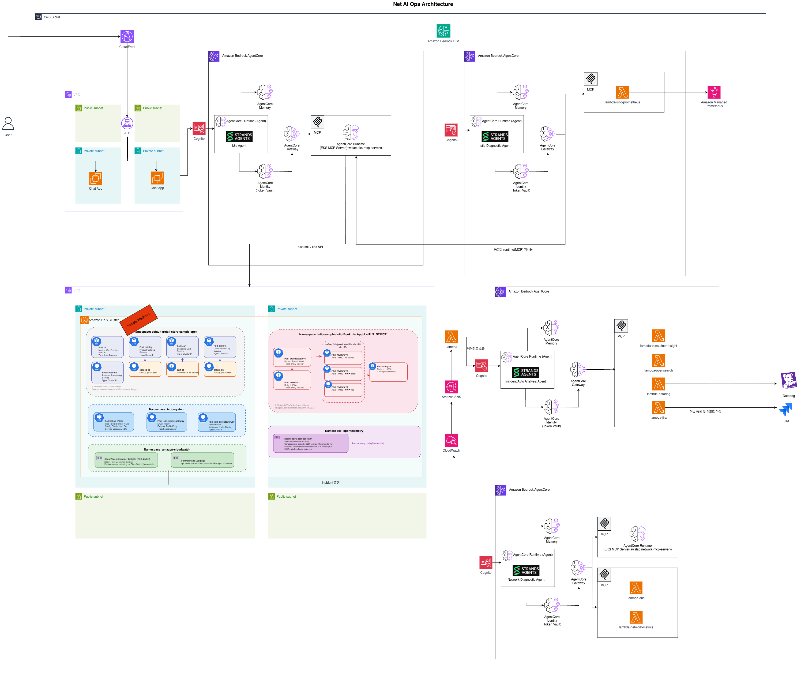

# NetAIOps Agent

AWS Bedrock AgentCore 기반 AI 네트워크/인프라 운영 에이전트

## 아키텍처



## 에이전트

| 에이전트 | 도메인 | MCP 도구 | 설명 |
|---------|--------|----------|------|
| **K8s Agent** | Kubernetes/EKS | EKS MCP Server | EKS 클러스터 진단, Pod 트러블슈팅, 리소스 관리 |
| **Incident Agent** | 장애 분석 | Datadog, OpenSearch, Container Insights | 다중 소스 장애 조사, 근본 원인 분석, GitHub 이슈 자동 생성 |
| **Istio Agent** | 서비스 메시 | EKS MCP Server, Prometheus | 트래픽 관리, 메트릭 상관 분석, 서비스 메시 진단 |
| **Network Agent** | AWS 네트워킹 | Network MCP Server, DNS, CloudWatch | VPC/서브넷 분석, DNS 진단, 네트워크 메트릭 조회 |

## 프로젝트 구조

```
netaiops-agent/
├── agents/
│   ├── k8s-agent/          # K8s 진단 에이전트
│   │   ├── agent/          #   에이전트 소스코드
│   │   └── prerequisite/   #   EKS MCP Server 설정
│   ├── incident-agent/     # 장애 분석 에이전트
│   │   ├── agent/          #   에이전트 소스코드
│   │   ├── agent-cached/   #   프롬프트 캐싱 적용 버전
│   │   └── prerequisite/   #   Lambda 함수 + 알람 설정
│   ├── istio-agent/        # Istio 메시 에이전트
│   │   ├── agent/          #   에이전트 소스코드
│   │   └── prerequisite/   #   Lambda 함수 설정
│   └── network-agent/      # 네트워크 진단 에이전트
│       ├── agent/          #   에이전트 소스코드
│       └── prerequisite/   #   Network MCP Server 설정
├── app/
│   ├── backend/            # FastAPI 백엔드 (API + static 서빙)
│   └── frontend/           # React 프론트엔드 (Vite + TypeScript)
├── infra-cdk/              # CDK 인프라 (Cognito, IAM, Lambda, SSM)
├── sample-workloads/
│   ├── retail-store/       # EKS Retail Store 샘플 앱
│   └── istio-sample/       # Istio Bookinfo 샘플 앱
├── docs/                   # 기술 문서 (GitBook, ko/en)
└── deploy.sh               # 통합 배포 스크립트 (Phase 1~4)
```

## 사전 요구 사항

- AWS CLI + 프로필 설정
- Node.js 18+ (CDK)
- Python 3.12+ (에이전트)
- AgentCore CLI (`agentcore`)
- Docker (Lambda 이미지 빌드)
- `kubectl` (EKS RBAC 설정)

## 배포

```bash
# 전체 배포 (CDK → EKS RBAC → MCP Server → Agent Runtime)
./deploy.sh
```

자세한 배포 절차는 [배포 가이드](docs/ko/deployment/README.md)를 참조하세요.

## 문서

| 문서 | 설명 |
|------|------|
| [아키텍처](docs/ko/architecture/README.md) | 시스템 아키텍처 상세 |
| [에이전트](docs/ko/agents/README.md) | 에이전트별 구성 및 도구 |
| [배포 가이드](docs/ko/deployment/README.md) | 전체 배포 절차 |
| [English Docs](docs/en/) | English documentation |

## 샘플 워크로드

| 워크로드 | 설명 | 사용 에이전트 |
|---------|------|-------------|
| [retail-store](sample-workloads/retail-store/) | EKS Retail Store 마이크로서비스 앱 | K8s Agent, Incident Agent |
| [istio-sample](sample-workloads/istio-sample/) | Istio Bookinfo 샘플 앱 | Istio Agent |
