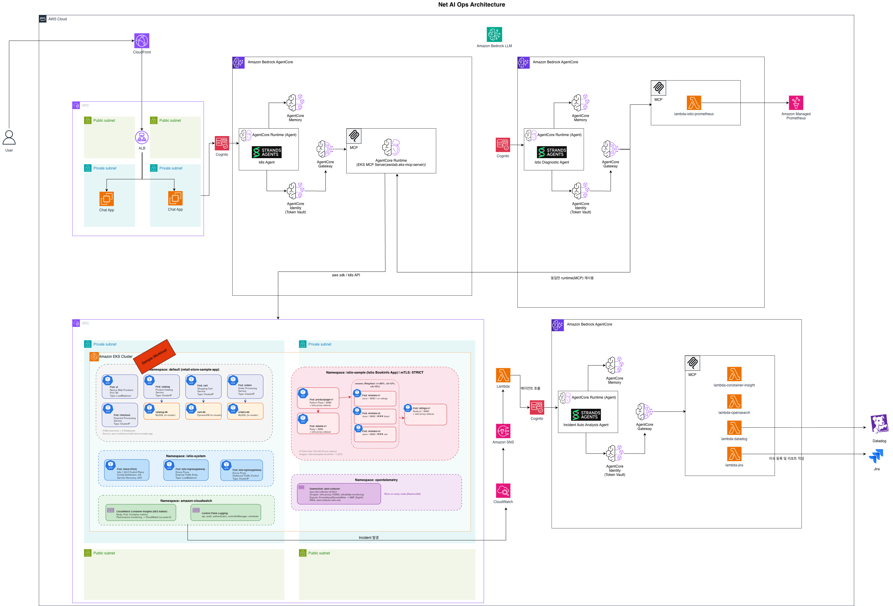

# 시스템 아키텍처

## 개요

NetAIOps는 계층형 아키텍처를 따릅니다. React 프론트엔드가 FastAPI 백엔드와 통신하고, 백엔드는 AWS Bedrock AgentCore에 배포된 AI 에이전트를 오케스트레이션합니다. 각 에이전트는 MCP(Model Context Protocol) Gateway를 통해 인프라 도구에 접근합니다.

## 전체 시스템 다이어그램



## 스트리밍 프로토콜

시스템은 실시간 스트리밍을 위해 Server-Sent Events(SSE)를 사용합니다.

```
Frontend ──POST /api/chat──► Backend ──HTTP Stream──► AgentCore Runtime
                                                          │
    ◄──── SSE: data chunks ◄──── text stream ◄────────────┘
    ◄──── SSE: metrics     ◄──── __METRICS_JSON__{...}
                           ◄──── __TOOLS_JSON__[...]
```

### 인밴드 마커 프로토콜

에이전트는 응답 스트림 끝에 메타데이터를 인밴드 마커로 전송합니다.

| 마커 | 형식 | 내용 |
|------|------|------|
| `__TOOLS_JSON__` | `__TOOLS_JSON__["tool-a","tool-b"]` | 사용된 MCP 도구 목록 |
| `__METRICS_JSON__` | `__METRICS_JSON__{"input_tokens":...}` | 토큰 사용량 메트릭 |

백엔드는 이 마커를 파싱하여 텍스트 스트림에서 제거하고, 타이밍 데이터, 토큰 사용량, 도구 목록을 결합한 최종 `{"metrics": {...}}` SSE 이벤트를 전송합니다.

## 데이터 흐름: 채팅 요청

```
1. User types message in ChatPage
2. Frontend POST /api/chat { agent_id, prompt, session_id, model_id }
3. Backend validates agent_id, gets M2M token
4. Backend resolves agent ARN from SSM
5. Backend invokes AgentCore runtime (HTTP streaming)
6. AgentCore routes to agent container
7. Agent uses Strands SDK to call Claude model
8. Model selects and calls MCP tools via gateway
9. Agent streams response chunks back
10. Backend parses markers, forwards text via SSE
11. Backend sends final metrics event
12. Frontend renders markdown + metrics footer + tool badges
```

## 인프라 레이어

| 레이어 | 관리 방법 | 리소스 |
|-------|-----------|--------|
| CDK | `npx cdk deploy` | Cognito, IAM, Lambda, SSM, CloudWatch |
| MCP Server | `agentcore deploy` | EKS MCP Server, Network MCP Server |
| MCP Gateway | boto3 API | Gateway, Gateway Targets |
| Agent Runtime | `agentcore deploy` | 에이전트 컨테이너 (ARM64) |
| Web UI | Docker + CloudFront | FastAPI + React SPA |

## 에이전트별 스택 아키텍처

### K8s Agent Stack

- **이중 Cognito Pool**: Agent auth(K8sAgentPool)과 Runtime auth(EksMcpServerPool)가 분리됨
- **Gateway → Runtime OAuth2**: Gateway가 EKS MCP Server 호출 시 별도 OAuth2 인증 수행
- **EKS MCP Server는 CLI로 배포**: CDK가 아닌 `agentcore deploy`로 배포, ARN은 SSM에 수동 저장
- **Istio Agent가 EKS MCP Server 재사용**: SSM을 통해 ARN/OAuth 정보 공유

### Incident Agent Stack

- **단일 Cognito Pool**: Agent auth만 존재(IncidentAnalysisPool)
- **6개 Lambda 도구**: Gateway 연결 3개(Datadog, OpenSearch, Container Insights) + 직접 호출 3개(Chaos, Alarm Trigger, GitHub)
- **모니터링**: CloudWatch Alarm → SNS → Alarm Trigger Lambda(자동 분석)

### Istio Agent Stack (하이브리드)

- **크로스 스택 종속성**: K8s Agent의 SSM 파라미터를 읽어 EKS MCP Server 접근
- **하이브리드 게이트웨이**: mcpServer 타겟(EKS MCP) + Lambda 타겟(Prometheus)
- **Fault injection은 UI 주도**: 에이전트는 읽기 전용 진단, fault injection은 FastAPI → Lambda 직접 호출

### Istio 크로스 스택 종속성

```
K8s Agent Stack (deploy first)              Istio Agent Stack (deploy after)
┌──────────────────────────────┐           ┌──────────────────────────────┐
│                              │  SSM ref  │                              │
│  EksMcpServerPool            │──────────→│  Istio Gateway               │
│  ├─ machine_client_id        │           │  ├─ OAuth2Provider           │
│  ├─ machine_client_secret    │           │  │  (K8s Runtime Pool creds)  │
│  ├─ cognito_token_url        │           │  │                            │
│  └─ cognito_auth_scope       │           │  └─ EksMcpServer Target       │
│                              │           │     (EKS MCP Server endpoint) │
│  EKS MCP Server Runtime      │──────────→│                              │
│  └─ eks_mcp_server_arn       │           │                              │
└──────────────────────────────┘           └──────────────────────────────┘
```

## SSM 파라미터 구조

각 에이전트의 Cognito, Gateway, Runtime 리소스는 생성 시 SSM에 파라미터를 저장합니다. 에이전트 Python 코드는 런타임에 SSM에서 읽어 MCP Gateway에 연결합니다.

```
{ssmPrefix}/
├── Cognito (CognitoAuth construct)
│   ├── userpool_id
│   ├── machine_client_id
│   ├── machine_client_secret
│   ├── web_client_id
│   ├── cognito_discovery_url
│   ├── cognito_token_url
│   ├── cognito_auth_url
│   ├── cognito_domain
│   ├── cognito_auth_scope
│   └── cognito_provider
│
├── Gateway (McpGateway construct)
│   ├── gateway_id
│   ├── gateway_name
│   ├── gateway_arn
│   └── gateway_url              ★ 에이전트 → 게이트웨이 연결의 핵심 파라미터
│
├── Runtime (runtime-stack)
│   ├── runtime_arn
│   └── runtime_name
│
└── IAM (cognito-stack)
    └── gateway_iam_role
```

### SSM 데이터 흐름

```
                        CDK Deploy                       Runtime
                        ==========                       =======

 ┌─────────────────┐    SSM Write    ┌──────────────┐    SSM Read     ┌──────────────┐
 │ CognitoAuth     │ ──────────────→ │              │ ─────────────→ │ Agent Python │
 │ (CDK construct) │   userpool_id   │              │   gateway_url  │ (agent.py)   │
 └─────────────────┘   client_id     │              │   token_url    │              │
                       client_secret  │              │   client_id    │ MCPClient(   │
 ┌─────────────────┐   token_url     │     SSM      │   client_secret│   gateway_url│
 │ McpGateway      │ ──────────────→ │  Parameter   │                │ )            │
 │ (CDK construct) │   gateway_url   │    Store     │                └──────────────┘
 └─────────────────┘   gateway_id    │              │
                       gateway_arn    │              │    SSM Read     ┌──────────────┐
 ┌─────────────────┐                 │              │ ─────────────→ │ CDK Gateway  │
 │ deploy-eks-     │   eks_mcp_      │              │  eks_mcp_      │ (at deploy   │
 │ mcp-server.sh   │ ──server_arn──→ │              │  server_arn    │  time)       │
 │ (CLI)           │                 │              │                │              │
 └─────────────────┘                 └──────────────┘                └──────────────┘
```

## 관련 페이지

- [Cognito 인증](cognito.md) — 상세 인증 흐름, 에이전트별 풀 구성
- [AgentCore 메모리](memory.md) — 메모리 구성, 전략 유형, 트러블슈팅
